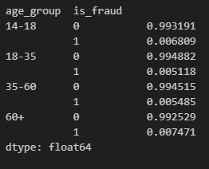
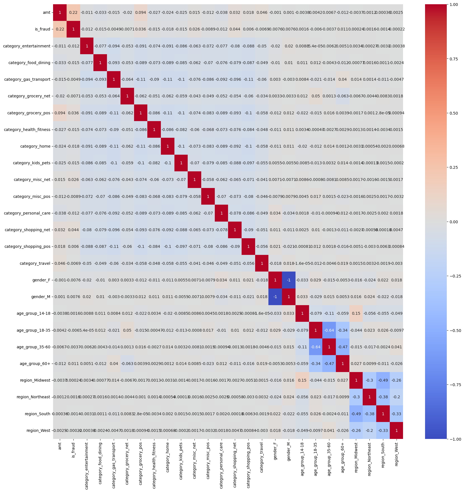

## Capstone Project
# Credit Card Fraud Detection

#### Link to Jupyter notebook files: [EDA and Modeling](capstone_Terrence.ipynb) , [Other Models](capstone_Terrence.ipynb)

[Kaggle dataset Used](https://www.kaggle.com/datasets/kartik2112/fraud-detection)

## Business Understanding

The objective of this project is to develop a robust system for detecting fraudulent credit card transactions, addressing a critical need for financial institutions to safeguard their customers and assets. Fraudulent activities in credit card transactions lead to significant financial losses, tarnish the reputation of institutions, and erode customer trust. The primary goal is to build a predictive model capable of accurately identifying fraudulent transactions while minimizing false positives, as excessive misclassification of legitimate transactions can inconvenience customers and lead to revenue loss.

Understanding the business context involves defining fraud in measurable terms, such as unauthorized transactions or abnormal spending patterns, and aligning the project with key performance metrics. These metrics could include precision (minimizing the number of legitimate transactions flagged as fraud), recall (maximizing the detection of actual fraudulent cases), and the overall cost savings resulting from fraud prevention. Additionally, the project must consider operational constraints, such as real-time prediction requirements and compliance with regulatory standards. Ultimately, the success of the project will hinge on its ability to strike a balance between detection accuracy and operational feasibility, ensuring it delivers tangible benefits to stakeholders.

Questions that can be asked include:
What constitutes a fraudulent transaction?
What is the acceptable threshold for false positives?
What are the costs associated with fraud and misclassification (both false positives and false negatives)?

## Data Understanding

Data has no nan values and is a clean dataset. There are 23 features, and will be only using a few select features. The target output variable is the 'is_fraud' column.

### EDA and Data Preparation

There are 3 visible groupings on transaction amounts flagged as fraud. Around the $0-$50 range, $250-$350 range and $850-$1000.

The three biggest merchant categories for fraud transactions are grocery_pos, shopping_net, and shopping_pos having the highest percentage of fraud transactions.

No significant differences in the proportion of fraud victims across genders. However, transaction volume differs notably between men and women. Women are involved in more transactions then men.

Determined age of person making transaction by subtracting year of transaction with date of birth year. Grouped ages into more managable labels (["14-18", "18-35", "35-60", "60+"])

Teenagers are the least likely demographic to fall victim to credit card fraud. This trend is likely attributed to their limited access to credit cards compared to older age groups.

Individuals in middle-age groups show a higher susceptibility to credit card fraud, as illustrated by the accompanying bar chart. This vulnerability may be explained by their increased frequency of credit card usage, which correlates with their financial activity and purchasing habits.

Notably, the percentage of fraudulent transactions is highest among individuals aged 60 or older, at 0.75%. This elevated rate may stem from lower levels of digital literacy within this demographic, making them more vulnerable to fraudulent schemes.

Grouped states into more manageble labels ('Midwest', 'Northeast', 'West', 'South', 'Midwest', 'Northeast', 'West')

Southern Region had the more amount of fraudulent transactions. Northeast Region had the highest percentage of fradulent transactions at 0.6%

The "job" and "merchant" columns contain 494 and 693 unique values, respectively. This high level of granularity makes it challenging to establish a meaningful relationship between these variables and the likelihood of fraud. Unlike the "age" and "state" variables, which could be grouped into broader, interpretable categories, there is no clear or logical way to consolidate the values in the "job" and "merchant" columns.

#### Data Preparation

Dropped most columns only keeping above columns for modeling.
Used One Hot Encoder for the following features: ['category', 'gender', 'age_group', 'region']

#### Heatmap

Low correlation with most features, highest being with amt and region_Midwest.

### Modeling

Used different classification models: 
- Logistic regression
- Decision tree classifier
- Random Forest Classifier.

Dataset has a training dataset and a testing dataset.

With each model, test accuracy was calculated. A reciever operator curve (ROC) was also calulated. Test accuracy shows an understanding of the model effectiveness and the ROC can be used to futher compare between models, which one would be more effective.

After base model tests were conducted, hypertuning of parameters were done using GridSearchCV to look for best parameters for each model.

### Evaluation

Findings analysis:

#### Logistic Regression:

Accuracy: 0.9955733023344532

Accuracy is very high; however, looking at the confusion matrix, it is clear that the model failed to correctly identify any fradulent transactions and is heavily biased toward predicting non fraud.

#### Logistic Regression with class weights:

Accuracy: 0.8953697822100738

The updated confusion matrix indicates that the current model demonstrates reduced bias in misclassifying fraudulent transactions as non-fraudulent, showing an improvement over the previous logistic regression model.

However, despite this improvement, the model's overall accuracy remains low. This is evidenced by the significant number of both false negatives and false positives, highlighting areas where the model's predictive performance requires further refinement.

#### Random Forest Classifier:

Accuracy: 0.9962571011608384

Comparing with the Logistic Regression with class weights, Random Forest Classifier is far superior with higher accuracry as well as futher minimizing false negatives and false positives.

#### Decision Tree Classifier:

Accuracy: 0.9996514161220044

Comparing with Random Forest, base Decsion Tree classifier produced similar confusion matrix categorizing about the same number of fradulent charges. It even categorized less false positives. However, the ROC area is considerably lower at 0.81 compared to Random Forest at 0.92.

#### Decision Tree Classifier with GridSearchCV:

Accuracy: 0.9976696855785028
Best parameter: max_depth = 10

Produced the best results by far. Almost halving the amount of false positive categorizing than the base decision tree classifier. Has the highest ROC area of any of the other models.

### Deployment

Based on evaluation above, Decision Tree Classifier may be the best model in terms of accuracy at 99.77 percent. With parameter tuning, Decision Tree has the highest accuracy best parameter being 'n_neighbors = 102'. 

The ROC curve analysis for all the models came out with Decision Tree having the highest area of 0.97.

Highest impact features include:
category_travel, amt, category_grocery_pos, and category_shopping_net

The merchant categories of travel, grocery_pos, and shopping_net can be categorized as high-risk categories to look into for fradulent charges.

Although determining the best model for this dataset for detecting fradulent charges was achieved, it can always be better, perhaps with more parameter tunning or even comparing more classifying models such as KNN or SVM.

Alot of the features were weakly correlated in determining fraudulent chargers, with the strongest just being the amount. It would perhaps be benefical to looking into other feature that might help in determining fradulent charges. Features such as transaction frequency, time of the day of the transaction, and location of charge being far from the users usual location. Looking into user spending patterns to determine transaction anamolies can be helpful.

Finding better fraud detection methods with machine learning helps institutions reduce time comsuming manual reviews, costly chargebacks and fees, and prevents denial of legitimate transactions.

*Refer to Jupyter notebook for more calculations and figures.